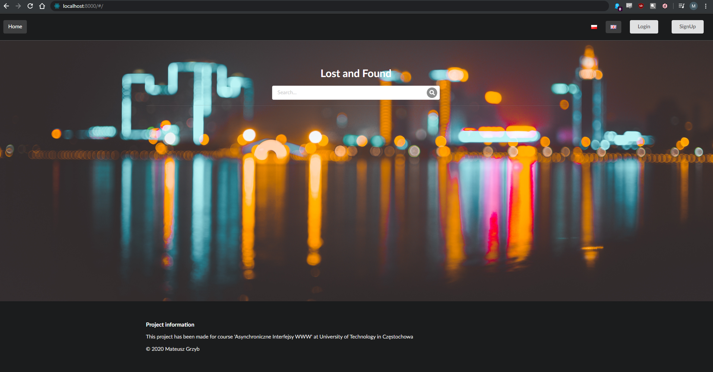
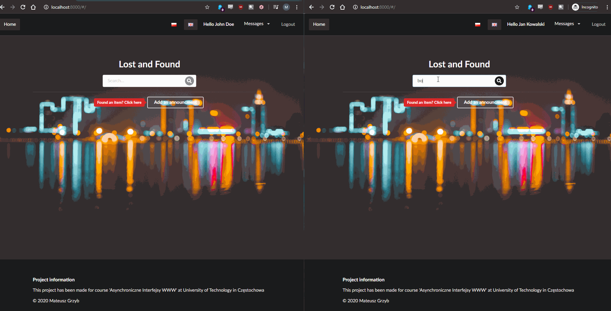

# Asynchronous Web Interfaces

This repository contains project made for course 'Asynchroniczne Interfejsy WWW' (Asynchronous Web Interfaces)
at University of Technology in Częstochowa

# Table of contents
* [About](#about)
* [Built With](#built-with)
* [Setup](#setup)
* [Demo](#demo)

# About

Online lost-and-found office - simple CRUD app with chat functionality. Users can put announcements with a lost/found item and write to each others via build-in chat. Project was created mainly for the purpose of learning ReactJS/Symfony4 and websockets.


# Built With

* [PHP 7.1](http://php.net/)
* [Symfony 4.0](https://github.com/symfony/symfony)
* [Api-Platform 2.2](https://github.com/api-platform/api-platform)
* [Ratchet 0.4](https://github.com/ratchetphp/Ratchet)
* [ReactJS](https://github.com/facebook/react)
* [Flux](https://github.com/facebook/flux)
* [Formik](https://github.com/jaredpalmer/formik)
* [react-live-chat](https://github.com/kingofthestack/react-chat-window)
* [socket-io.client](https://github.com/socketio/socket.io-client)
* [Semantic UI React](https://github.com/Semantic-Org/Semantic-UI-React)

# Setup
## Requirements
* [LAMP](https://en.wikipedia.org/wiki/LAMP_(software_bundle))/[WAMP](https://en.wikipedia.org/wiki/LAMP_(software_bundle)#WAMP) stack with PHP version 7.1+
* [Composer](https://getcomposer.org/)
* [Yarn](https://yarnpkg.com/getting-started/install)
* [Symfony](https://symfony.com/download)

## Installation
**Clone reposition**
```
git clone https://github.com/mattheq/AsynchroniczneInterfejsyWWW.git
```

**Run the following commands in project root directory to install project dependencies**
```
composer install
yarn install
symfony install
```

**Create the database by running the following command**
```
php bin/console doctrine:database:create
```

**Run database migration**
```
php bin/console doctrine:migrations:migrate
php bin/console doctrine:schema:update --force
```

**Generate the SSH keys**
```
mkdir -p config/jwt
$ openssl genpkey -out config/jwt/private.pem -aes256 -algorithm rsa -pkeyopt rsa_keygen_bits:4096
$ openssl pkey -in config/jwt/private.pem -out config/jwt/public.pem -pubout
```

**Configure environment variables**

Create .env file by coping .env.dist file
```
cp .env.dist .env
```
Update *DATABASE_URL* and *JWT_PASSPHRASE* variables

## Run the app locally
**Start symfony server**
```
symfony server:start
```
**Start websockets server**
```
php bin/console sockets:start-chat
```
**Run webpack**
```
yarn encore dev --watch
```
Visit [localhost:8000/#/](http://localhost:8000/#/) to open app 👇

# Demo
## 💻 Working demo can be found here: https://app-lost-and-found.herokuapp.com/

## 📢 **Chat doesn't work in this demo, because heroku doesn't allow to have the websockets server running alongside a PHP app - [link](https://help.heroku.com/8R7OO0ZV/can-i-run-a-websockets-server-using-php-on-heroku)** ⚠️

### 👇 Gif with chat functionality
